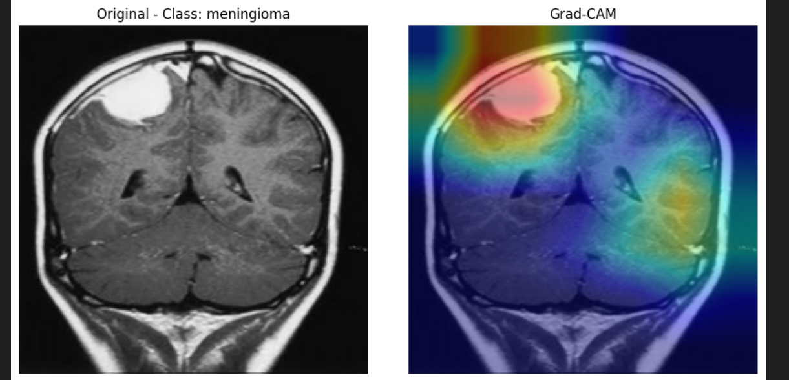
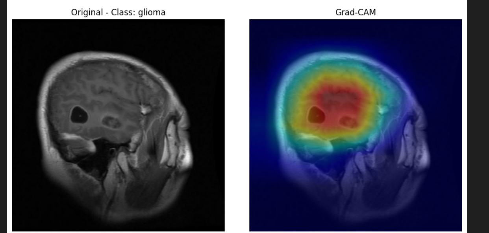
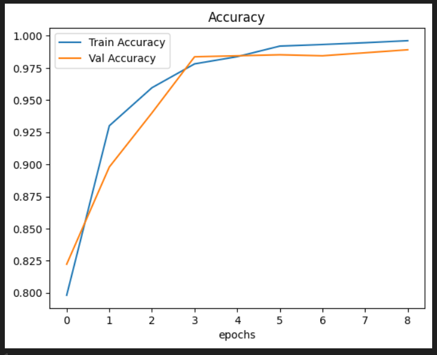
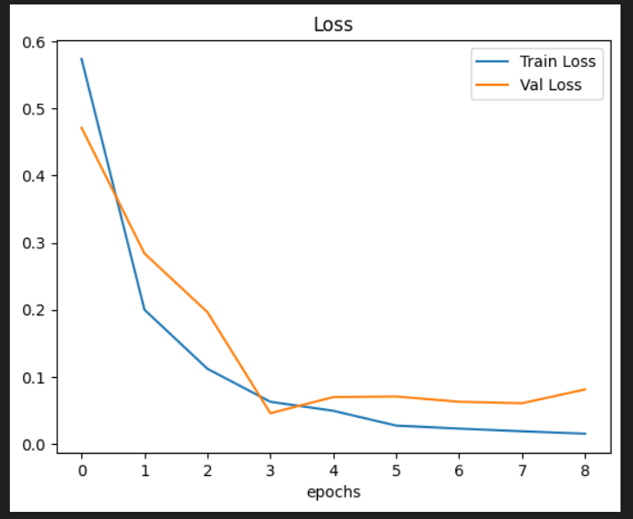
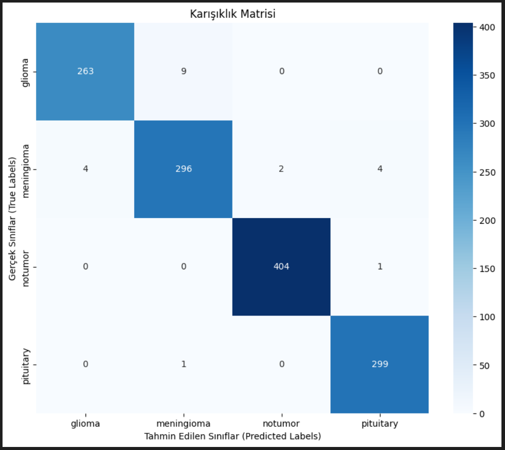

# Brain Tumor Classification with CNN and EfficientNetB3




## 🚀 Live Demo
Try it now: [Hugging Face Spaces](https://huggingface.co/spaces/emiraran/brain-tumor-classification)

## Overview
This project implements a deep learning pipeline for classifying brain tumor MRI images into four categories: **glioma**, **meningioma**, **notumor**, and **pituitary**. The model leverages transfer learning with EfficientNetB3 and includes interpretability with Grad-CAM visualizations.

## Motivation
Brain tumor classification from MRI images is a critical task for early diagnosis and treatment planning. Manual analysis is time-consuming and subjective. This project aims to:
- Automate tumor classification with high accuracy
- Provide interpretable results for clinicians using Grad-CAM
- Demonstrate a reproducible, professional deep learning workflow

## Dataset
- The dataset is not included due to size. Download it using the link in `dataset_link.txt`.
- Organize the data as:
  - `Training/` (with subfolders for each class)
  - `Testing/` (with subfolders for each class)

## Project Structure
- `model.ipynb`: Main notebook with all steps, explanations, and visualizations
- `best_weights_balanced.h5`: Best model weights (saved automatically)
- `dataset_link.txt`: Dataset download link
- `README.md`: This file
- Grad-CAM example images: `gradcam1.png`, `gradcam2.png`

## Approach & Steps
1. **Data Loading & Visualization**
   - Loads images using TensorFlow's `image_dataset_from_directory`
   - Visualizes sample images and class distribution
2. **Class Imbalance Analysis**
   - Plots class counts to check for imbalance
   - (If needed, you can add class weighting or augmentation)
3. **Model Architecture**
   - Uses EfficientNetB3 (pretrained on ImageNet) as feature extractor
   - Adds custom dense, batch normalization, and dropout layers
   - Output layer: softmax for 4 classes
4. **Training**
   - Early stopping, learning rate scheduling, and best weight saving
   - Plots training/validation loss and accuracy
5. **Evaluation**
   - Prints test loss, accuracy, precision, recall, F1-score
   - Shows confusion matrix
6. **Interpretability: Grad-CAM**
   - Generates Grad-CAM heatmaps for test images
   - Helps understand which regions the model focuses on for its decision

## Model Performance

### Training Metrics
- **Test Accuracy**: 98%
- **Macro Avg F1-Score**: 0.98

### Accuracy & Loss Curves
| Accuracy | Loss |
|----------|------|
|  |  |

### Classification Report
```
              precision    recall  f1-score   support
       glioma       0.99      0.97      0.98       272
   meningioma       0.97      0.97      0.97       306
     no tumor       1.00      1.00      1.00       405
    pituitary       0.98      1.00      0.99       300

       accuracy                           0.98      1283
      macro avg       0.98      0.98      0.98      1283
   weighted avg       0.98      0.98      0.98      1283
```

### Confusion Matrix
The model shows excellent performance across all classes:
- **Glioma**: 263/272 correct (97%)
- **Meningioma**: 296/306 correct (97%)
- **No Tumor**: 404/405 correct (100%)
- **Pituitary**: 299/300 correct (100%)


## Example Results
Below are Grad-CAM visualizations showing the model's attention on MRI images:


## How to Run
1. Install requirements (see notebook for package list)
2. Download and extract the dataset as described above
3. Run `model.ipynb` step by step
4. Review the outputs, metrics, and Grad-CAM visualizations

## Key Points & Best Practices
- **Transfer Learning**: EfficientNetB3 enables strong feature extraction with limited data
- **Callbacks**: Early stopping and best weight saving prevent overfitting
- **Visualization**: Data and training curves are visualized for transparency
- **Interpretability**: Grad-CAM provides insight into model decisions
- **Reproducibility**: All steps are documented and reproducible

## License
This project is for educational and research purposes only.
